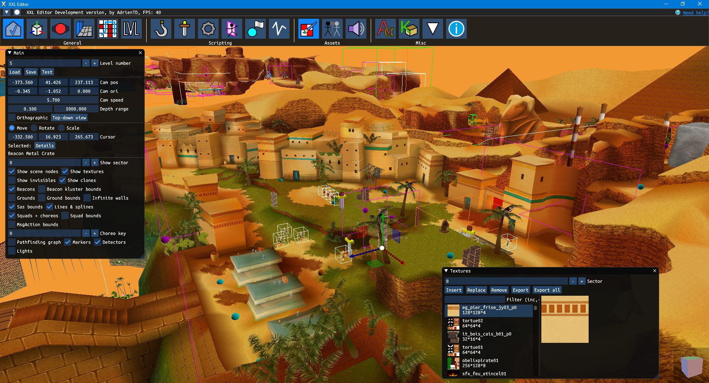
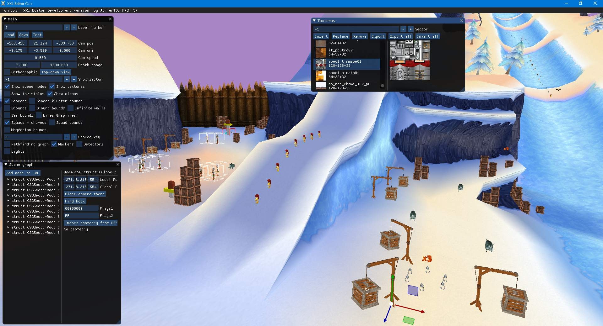
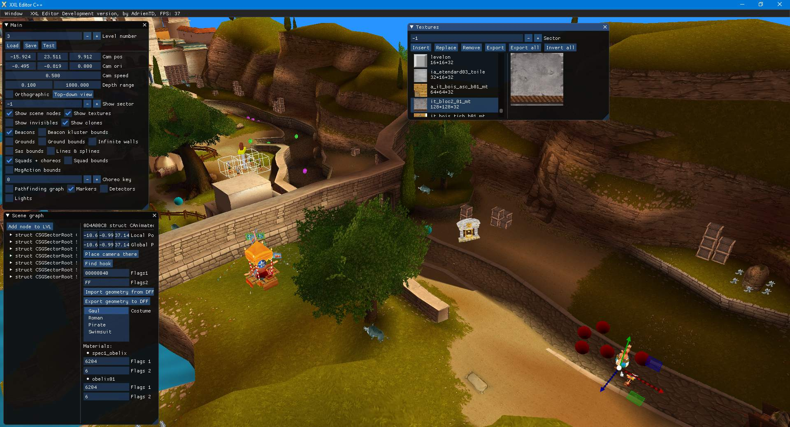

# XXL Editor

Level editor for games based on ELB's Kal engine, such as the Asterix & Obelix XXL series.

The level editor is still in early development, thus some features might be missing or buggy, depending on the game used.

Licensed under the MIT License.

Only works on Windows (Vista and later), though efforts are done to make ports to other operating systems easy in the future.

To download the editor, go to the [Releases page](https://github.com/AdrienTD/XXL-Editor/releases).

Check the [Wiki on this repository](https://github.com/AdrienTD/XXL-Editor/wiki) for guides on how to use the editor.

## Features

Stuff that can be (partially) viewed and modified in the editor include:

* Scene nodes
* Beacons (locations for bonuses and crates)
* Enemy squads and choreographies
* Ground collision
* Pathfinding graph
* Trigger shapes
* Events
* Textures
* Sounds
* Model import/export in Renderware DFF format
* Localized text for XXL1

## Supported games

The games that are currently supported by the XXL Editor include:

* A&O XXL 1 (2003)
* A&O XXL 2: Mission Las Vegum (2005)
* Asterix at the Olympic Games (2007)
* A&O XXL 2 HD (2018)
* A&O XXL Romastered (2020)

Support for other games using the Kal engine, such as Arthur and Spyro DotD, has been looked into and certain features are partially supported,
but way more limited compared to the XXL series, as the focus of this project is on Asterix XXL for now.

Some features can be supported or unsupported depending on the game and platform used.
XXL1 is the most supported game, where you can even manipulate object behaviour, event scripts, enemies, etc.

Also, it is preferrable to mod the PC versions of the games, as you can see and edit 3D models, textures and sounds, whereas on console
this might not be the case (the models are invisible, you can only change position of bonuses displayed as red blinking spheres instead of their models, ...).

Adding support for consoles is difficult since the Renderware Texture and Geometry chunks are often stored in a native format specific to the console
which is not necessarily well documented and requires knowledge of the console's architecture.

Support for models/textures has been added for GameCube and Wii platforms, though there are limitations
(lossy DXT1 texture compression, broken rigging when importing an animated model, ...).

The Remasters of both XXL 1 and XXL 2 are also supported. While the editor does load the original models/textures/sounds stored in the KWN files,
modifying them there won't have any effect since the remaster replaces them with converted assets in the Cooking folder for the new graphics engine.

## Compiling Requirements
* Visual Studio 2017/2019 (other versions untested)
* [vcpkg](https://github.com/Microsoft/vcpkg) with the following installed packages: inih, sdl2, stb, libsquish, nlohmann-json
* Open the VS solution file, and as long as [vcpkg integration](https://docs.microsoft.com/en-us/cpp/build/integrate-vcpkg) is applied, you should be able to compile.

## Thanks
* Thanks to S.P.Q.R. for some code addition and names for events and squad actions.

## Libraries used:
* [Dear Imgui](https://github.com/ocornut/imgui)
* [ImGuizmo](https://github.com/CedricGuillemet/ImGuizmo)
* [inih](https://github.com/benhoyt/inih)
* [SDL 2](https://www.libsdl.org)
* [stb](https://github.com/nothings/stb)
* [libsquish](https://sourceforge.net/projects/libsquish/)
* [JSON for Modern C++](https://github.com/nlohmann/json)
* [\{fmt\}](https://github.com/fmtlib/fmt)

## Other Screenshots (old):

